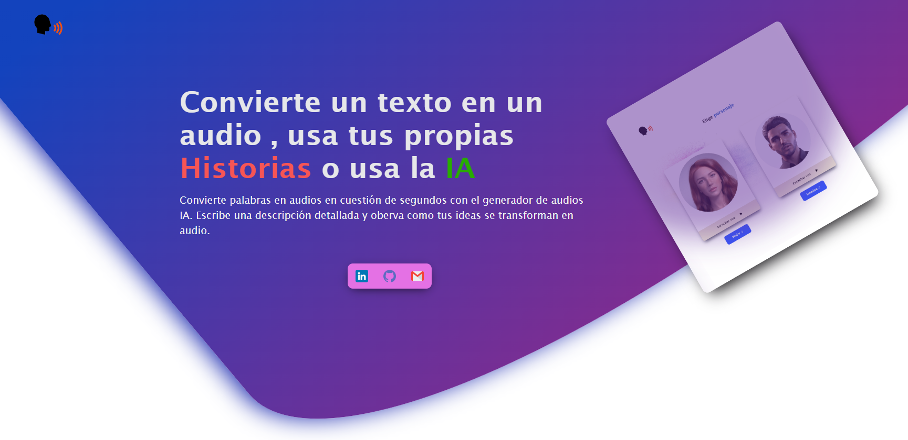
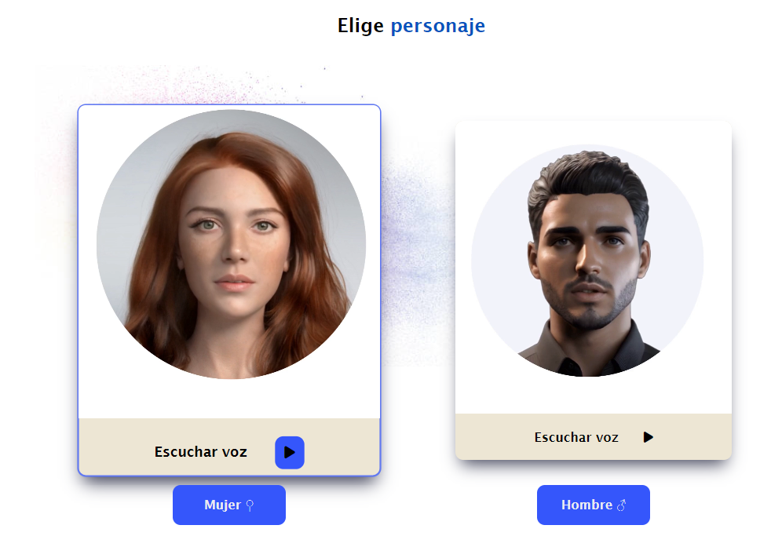

# Text-to-Audio Generator

Este proyecto permite convertir texto en audio, ofreciendo dos opciones:

<ul>
  <li><strong>Texto Personalizado</strong>: Ingresa tu propio texto para convertirlo en audio.</li>
  <li><strong>Texto Generado por IA</strong>: Utiliza IA para crear texto automáticamente y luego conviértelo en audio.</li>
</ul>

<h2>Funcionalidades</h2>
<ul>
  <li>Conversión de texto a audio.</li>
  <li>Generación de texto utilizando IA.</li>
  <li>Selección de voz entre femenina y masculina.</li>
</ul>

<h2>Requisitos</h2>
<ul>
  <li>Pyhton y Flask</li>
  <li>pip</li>
  <li>API de IA (OpenAI)</li>
  <li>API de las voces (Amazon polly)</li>
  <li>En el fichero "requirements" están todas las bibliotecas que tienes que instalar</li>

</ul>

<h2>Instalación</h2>
<ol>
  <li>Clona este repositorio:
    <pre><code>git clone https://github.com/hectorpzdiaz/HistoriasConVoz-.git</code></pre>
  </li>
  <li>Navega al directorio del proyecto:
    <pre><code>cd tu-repositorio</code></pre>
  </li>
  <li>Instala las dependencias necesarias:
    <pre><code>pip install</code></pre>
  </li>
</ol>

<h2>Uso</h2>
<ol>
  <li><strong>Texto Personalizado</strong>:
    <ul>
      <li>Ingresa tu texto.</li>
      <li>Selecciona la voz.</li>
      <li>Haz clic en "Convertir a audio".</li>
    </ul>
  </li>
  <li><strong>Texto Generado por IA</strong>:
    <ul>
      <li>Haz clic en "Generar texto con IA".</li>
      <li>Utiliza el texto generado.</li>
      <li>Conviértelo a audio.</li>
    </ul>
  </li>
</ol>

<h2>Contribución</h2>

Si quieres contribuir, sigue estos pasos:

<ol>
  <li>Haz un fork del repositorio.</li>
  <li>Crea una rama para tu contribución.</li>
  <li>Haz tus cambios y envía un pull request.</li>
</ol>

<h2>Licencia</h2>

Este proyecto está bajo la Licencia <a href="https://opensource.org/licenses/MIT">MIT</a>.

